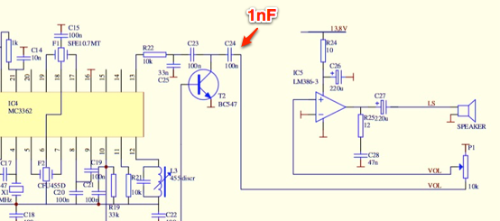
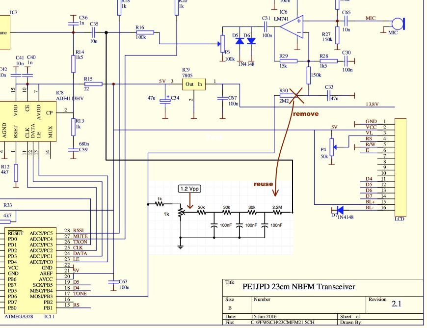

# Tips, Tricks and Hardware Modifications

Building the 23cm transceiver kit will get you a working transceiver, but you want
more of course. So here are my notes on modifications we've done on some of the
transceivers.

## Gotchas, problems and solutions

## Modifications and improvements.

### Remove receiver audio rumbling

Even with a strong FM signal you'll notive a low rumble in the audio. This is the MC3362
detecting all audio frequencies. To stop the lower frequencies from reaching the speaker,
replace C24 with a 1nF capacitor.

### Improve Subaudio (greatly)

When using sub-audio to active a repeater, people will notice a ver noticeable hum on 
your audio. We noticed that this hum is caused by a combination of factors:

1. The subaudio is generated as a square wave by the Atmega328 processor, slightly
   filtered, and added to the microphone signal before the microphone pre-amp. At this
   point, it contains quite a few harmonics.
2. The Atmega328 is running on its internal oscillator. This is not exact, and in our case
   we noticed it to be lower than it should be. This causes the 88.5 sub-audio menu setting
   to generate a 88.1 sub-audio tone.
3. Turning up your mic gain also turns up the sub-audio with it.

This can be fixed with a simple 3rd order low-pass filter, and injecting the resulting
sub-audio tone after the microphone amplifier, like so:

Remove R30 (2M2) and save it. Connect a 1k resistor to pin 17 of the Atmega using
one of the pads where R30 was sitting. Build the rest of the low-pass filter as in the
schematic above, and re-use the 2M2 resistor to connect the output to R16 at the side of C35.

In my transceiver, it looks like this:

Power on the transceiver, select a sub-audio tone and connect an oscilloscope to the runner
of the potentiometer. When transmitting, adjust the output at the runner to 1.2 Vpp. It
should look like a square wave on your screen at that point.

When done correctly, this level should be enough to open any sub-audio repeater, but the
filtered tone will not be heard by the receiving party.
